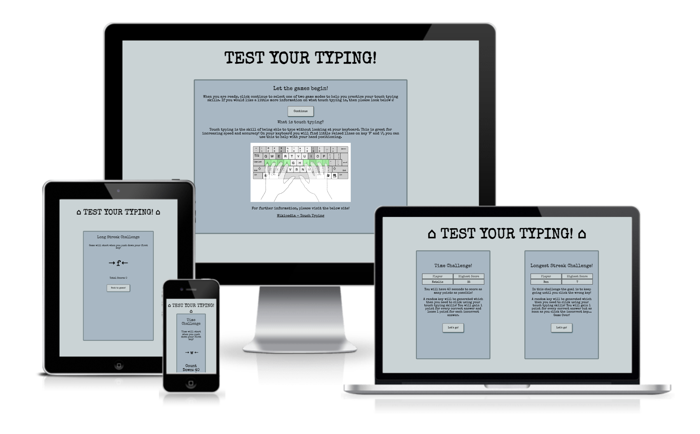
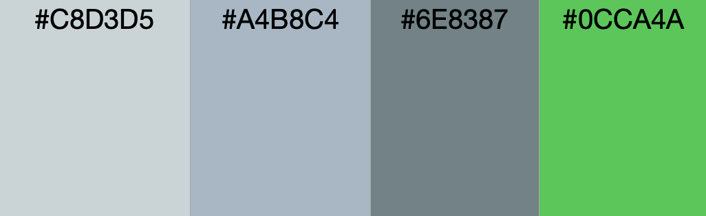
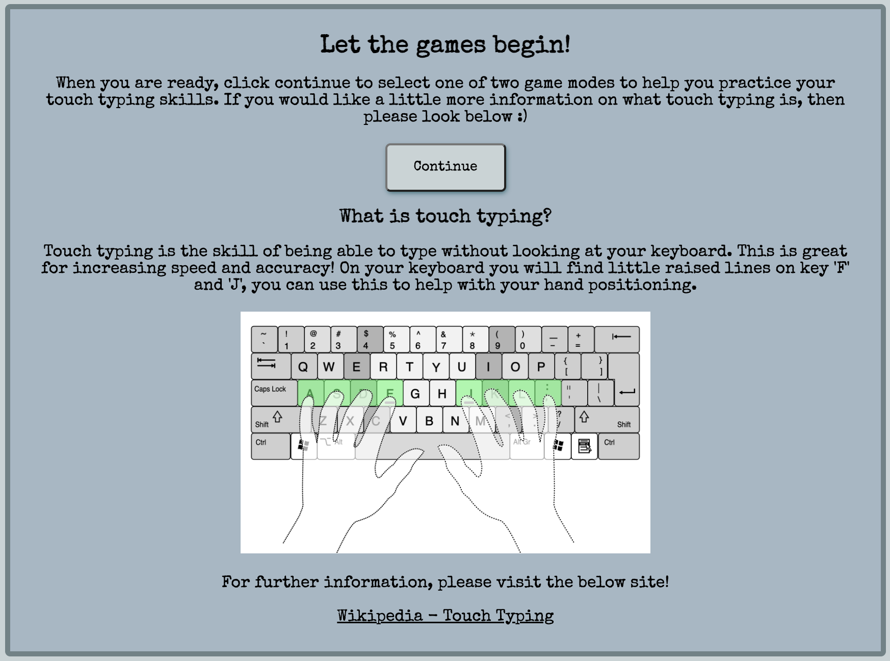
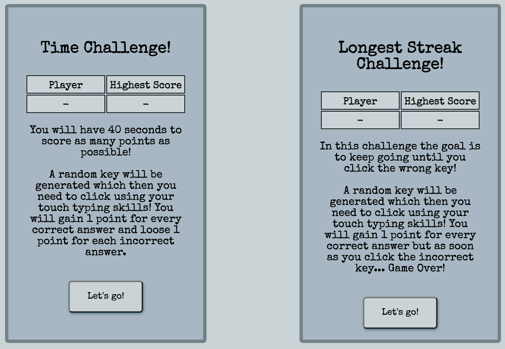
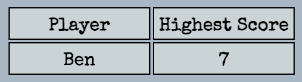
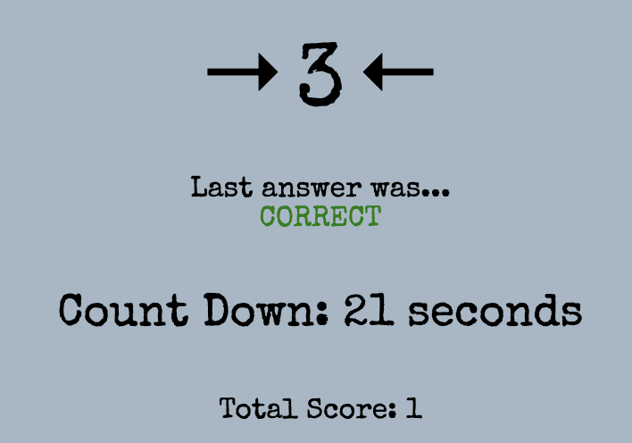
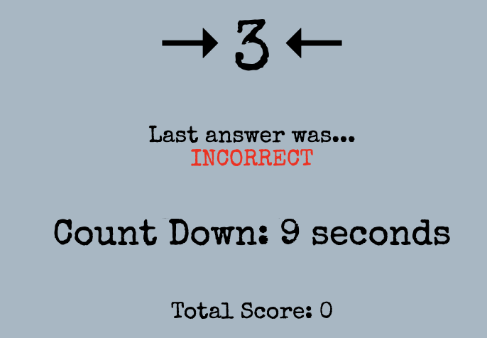

# Test Your Typing

Test Your Typing is a interactive online tool that aims to enable users to practice and improve their touch typing skills. The aim is to deliver this in a fun and self competive manner to encourage practice!

Two games modes are provided to in the form of a time and longest streak challenge.

## Tabel of Contents
+ [Requirements](#requirements "Requirements")
+ [Design](#design "Design")
  + [Wireframes](#wireframes "Wireframes")
  + [Colour Scheme](#colour-scheme "Colour Scheme")
  + [Typography](#typography "Typography")
  + [Imagery](#imagery "Imagery")
+ [Features](#features "Features")
  + [Existing Features](#existing-features "Existing Features")
+ [Testing](#testing "Testing")
  + [User Testing](#user-testing "User Testing")
  + [Functional Testing](#functional-testing "Functional Testing")
  + [Validator Testing](#validator-testing "Validator Testing")
  + [Unfixed Bugs](#unfixed-bugs "Unfixed Bugs")
+ [Technologies Used](#technologies-used "Technologies Used")
  + [Main Languages Used](#main-languages-used "Main Languages Used")
+ [Deployment](#deployment "Deployment")
+ [Credits](#credits "Credits")
  + [Content](#content "Content")
  + [Media](#media "Media")

## Requirements

Please see below a table showing the desired requirements for Test Your Typing, with a matrix for importance of feature and feasibility of implementation.

|   Requirement                                       |   Importance  |   Viability/Feasibility  |
|--------------------------------------------------------|------------------|-----------------------------|
|   Provide Information about touch typing            |   5           |   5                      |
|   Provide game style practice                       |   5           |   5                      |
|   Enable high scores to be recorded with user name  |   5           |   5                      |
|   Provide a choice of game modes                    |   4           |   5                      |
|   Enable high scores to be reset                    |   3           |   3                      |

## Design

### Wireframes:

- Please find link to [Full Screen Wireframe](documentation/full-wireframe.pdf)

### Colour Scheme:

- A neutral colour scheme was chosen to enable it to not distract from the games, with a highlight colour for external links.
- The colour scheme was generated from [Coolers](https://coolors.co/c8d3d5-a4b8c4-6e8387-0cca4a)

### Typography:

- Special Elite was used as the font for the website, this was chosen to provide a type writer feel to compliment the typing theme.
- The font style was sourced from [Google Fonts](https://fonts.google.com/)

### Imagery:

There are two images in the website, I have listed their sources below.

- On the home page there is a image of a keyboard, this was sourced from [Wikipedia](https://en.wikipedia.org/wiki/Touch_typing#/media/File:QWERTY-home-keys-position.svg)
- On the high score submission section there is a image of a thumbs up, this was created using tools from [Shutterstock](https://www.shutterstock.com/)

## Features

### Existing Features

#### Title and Home Navigation:

Present at the top of every page is the title header, this is linked to return the user back to the home page. On the game select, time challenge and long streak challenge pages a home icon has been added to this. This is to further communicate to the user that they are able to use this as a link to the home page at any stage of their user journey.

Title on home page -

Title on all other pages -

#### Landing Page:

The landing page of the website, conveys the clear goal of the website to practice typing in a game mode. This is done with the opening line, 'Let the games begin!'. After which is a brief explanation and the user is presented with the option to continue straight to the games.

Further down there is information on type touching, a supporting image and a link to further external information. The link opens up in a new tab so the users access to the site remains.

#### Game Selection:

To provide different approaches for the user to test and practice their typing skills, two different game modes are available. From the landing page, the users progression is to game selection.

Both game options are layed out in the same structure to ensure continuity and ease for user reading. Each game mode is enclosed in its own container, with clear buttons to select the game.

Each section illustrates it's independent highest score that is saved in local storage. Please see example below -

#### Time Challenge:

The Time Challenge game presents the user with a starting key to press and a 40 seconds timer. At the top, it is instructed to the user that the game commences on the first key press.

Once in progress the timer will start to count down, and each time a key is pressed a new random key is then generated for the user. With each correct key the score increases by 1 and with each incorrect key it decreases by 1. At the end of the game, the final score is then used to compare to the current highest score.

To communicate to the player whether they have clicked the correct key, ongoing feed back in given directly under the random key generation.

Correct score response -

Incorrect score response - 

### Future Features:

## Testing

### User Testing

|   User Case  |   Description                                                                                                |   Relevant test cases                                                    |   Result  |   Comments                                                                |
|-----------------|-----------------------------------------------------------------------------------------------------------------|--------------------------------------------------------------------------------------|--------------|------------------------------------------------------------------------------|
|   UC-001     |   As a user I want to be able to learn about touch typing and gain further information.                      |   TC-002                                                                          |   Pass    |                                                                           |
|   UC-002     |   As a user I want to practice to improve the speed of my touch typing.                                      |   TC-004, TC-011                                                                  |   Pass    |                                                                           |
|   UC-003     |   As a user I want to test the accuracy of my typing to see how long I can type for before making an error.  |   TC-005, TC-019                                                                  |   Pass    |                                                                           |
|   UC-004     |   As a user I want to be able to be able to see a record of my highest scores.                               |   TC-006, TC-007, TC-008, TC-009, TC-013, TC-014, TC-015, TC-021, TC-022, TC-023  |   Pass    |                                                                           |
|   UC-005     |   As a user I wish to be able to reset my high scores                                                        |                                                                                   |   Fail    |   A lower level requirement that will be implemented as a future feature  |
|   UC-006     |   As a user I wish to be able to return to the home screen at any stage.                                     |   TC-003, TC-010, TC-018                                                          |   Pass    |                                                                           |
|   UC-007     |   As a user I wish to be able to return to the game selection at any stage.                                  |   TC-001, TC-012, TC-020                                                          |   Pass    |                                                                           |

### Functional Testing

Functional Test Cases

|   Test Case  |   Description                                                                                                |   Pre Conditions                                                                              |   Steps to Executed                                                                                                                                                                      |   Result  |   Comments  |
|-----------------|-----------------------------------------------------------------------------------------------------------------|--------------------------------------------------------------------------------------------------|---------------------------------------------------------------------------------------------------------------------------------------------------------------------------------------------|--------------|----------------|
|   TC-001     |   Home Page - Continue button opens page to select game mode.                                                |   N/A                                                                                         |   1. Active page is index.html  2. Click ‘Continue’ button  3. Check that active page is now game select.html                                                                      |   Pass    |             |
|   TC-002     |   Home Page - Link to Wikipedia Touch Typing opens in a new tab.                                             |   N/A                                                                                         |   1. Active page is index.html  2. Click on Wikipedia link  3. Check Wikipedia opens on new tab in browser                                                                         |   Pass    |             |
|   TC-003     |   Game Select Page - Home icon and title returns user to home page.                                          |   N/A                                                                                         |   1. Active page is gameselect.html  2. Click on home icon link  3. Check active page changes to index.html                                                                        |   Pass    |             |
|   TC-004     |   Game Select Page - In the Time Challenge section, ’Let’s Go!’ Button opens the Time Challenge game.        |   N/A                                                                                         |   1. Active page is gameselect.html  2. Click on ‘Let’s Go!’ Button under Time Challenge  3. Check active page changes to timechallenge.html                                       |   Pass    |             |
|   TC-005     |   Game Select Page - In the Long Steak section, ’Let’s Go!’ Button opens the Long Streak game.               |   N/A                                                                                         |   1. Active page is gameselect.html  2. Click on ‘Let’s Go!’ Button under Long Streak Challenge  3. Check active page changes to longstreak.html                                   |   Pass    |             |
|   TC-006     |   Game Select Page - Time Challenge high score displays ‘-‘ when no score is stored.                         |   No high score for Time Challenge is stored in Local Storage                                 |   1. Active page is gameselect.html  2. Check high score table in the Time Challenge section displays ‘-‘ values under name and score                                                 |   Pass    |             |
|   TC-007     |   Game Select Page - Long Streak Challenge high score displays ‘-‘ when no score is stored.                  |   No high score for Long Streak Challenge is stored in Local Storage                          |   1. Active page is gameselect.html  2. Check high score table in the Long Streak Challenge section displays ‘-‘ values under name and score                                          |   Pass    |             |
|   TC-008     |   Game Select Page - Time Challenge high score displays user name and score held in Local Storage.           |   High score has been recorded in Local Storage from the Time Challenge                       |   1. Active page is gameselect.html  2. Check high score table in the Time Challenge section displays the user name and score held in Local Storage                                   |   Pass    |             |
|   TC-009     |   Game Select Page - Long Streak Challenge high score displays user name and score held in Local Storage.    |   High score has been recorded in Local Storage from the Long Streak Challenge                |   1. Active page is gameselect.html  2. Check high score table in the Long Streak Challenge section displays the user name and score held in Local Storage                            |   Pass    |             |
|   TC-010     |   Time Challenge Page - Home icon and title returns user to home page.                                       |   N/A                                                                                         |   1. Active page is timechallenge.html  2. Click on home icon link  3. Check active page changes to index.html                                                                     |   Pass    |             |
|   TC-011     |   Time Challenge Page - Game starts on user first key push down event.                                       |   N/A                                                                                         |   1. Active page is timechallenge.html  2. Push down any key on the keyboard  3. Check timer starts to count down and score increases/decreases appropriately                      |   Pass    |             |
|   TC-012     |   Time Challenge Page - ‘Back to Games!’ Button returns the user to the Game Select page.                    |   N/A                                                                                         |   1. Active page is timechallenge.html  2. Click on ‘Back to Games!’ Button  3. Check active page is now gameselect.html                                                           |   Pass    |             |
|   TC-013     |   Time Challenge Page - Upon game ending, if high score is achieved, new high score submission is shown.     |   At the end of the game, the score is higher than the one currently stored in Local Storage  |   1. Active page is timechallenge.html  2. Complete game with final score being higher than currently stored  3. Check new high score submission appears                           |   Pass    |             |
|   TC-014     |   Time Challenge Page - High Score submission allows the user to type in the name for score storage.         |   The high score submission is open for Time Challenge                                        |   1. Click into input text field.  2. Type name in field                                                                                                                              |   Pass    |             |
|   TC-015     |   Time Challenge Page - High Score submission allows the user to submit the new score                        |   The high score submission is open for Time Challenge and user name has been entered         |   1. Click on the submission button.  2. Check that the new high score has overwritten the previous in Local Storage.                                                                 |   Pass    |             |
|   TC-016     |   Time Challenge Page - Upon game ending, if no high score is achieved, a pop up appears to inform the user  |   At the end of the game, the score is lower than the one held in Local Storage               |   1. Active page is timechallenge.html  2. Complete game with final score being lower than currently stored  3. Check pop up appears to inform the user no new high score achieve  |   Pass    |             |
|   TC-017     |   Time Challenge Page - No high score pop up allows the user to return to game select page.                  |   The no high score pop up for Time Challenge is open                                         |   1. Click on ‘Return to Games!’ Button  2.Check that active page is now gameselect.html                                                                                              |   Pass    |             |
|   TC-018     |   Long Streak Page - Home icon and title returns user to home page.                                          |   N/A                                                                                         |   1. Active page is longstreak.html  2. Click on home icon link  3. Check active page changes to index.html                                                                        |   Pass    |             |
|   TC-019     |   Long Streak Page - Game starts on user first key push down event.                                          |   N/A                                                                                         |   1. Active page is longstreak.html  2. Push down requested key on the keyboard  3. Check new letter appears and score goes up                                                     |   Pass    |             |
|   TC-020     |   Long Streak Page - ‘Back to Games!’ Button returns the user to the Game Select page.                       |   N/A                                                                                         |   1. Active page is longstreak.html  2. Click on ‘Back to Games!’ Button  3. Check active page is now gameselect.html                                                              |   Pass    |             |
|   TC-021     |   Long Streak Page - Upon game ending, if high score is achieved, new high score submission is shown.        |   At the end of the game, the score is higher than the one currently stored in Local Storage  |   1. Active page is longstreak.html  2. Complete game with final score being higher than currently stored  3. Check new high score submission appears                              |   Pass    |             |
|   TC-022     |   Long Streak Page - High Score submission allows the user to type in the name for score storage.            |   The high score submission is open for Long Streak Challenge                                 |   1. Click into input text field.  2. Type name in field                                                                                                                              |   Pass    |             |
|   TC-023     |   Long Streak Page - High Score submission allows the user to submit the new score                           |   The high score submission is open for Long Streak Challenge and user name has been entered  |   1. Click on the submission button.  2. Check that the new high score has overwritten the previous in Local Storage.                                                                 |   Pass    |             |
|   TC-024     |   Long Streak Page - Upon game ending, if no high score is achieved, a pop up appears to inform the user     |   At the end of the game, the score is lower than the one held in Local Storage               |   1. Active page is longstreak.html  2. Complete game with final score being lower than currently stored  3. Check pop up appears to inform the user no new high score achieve     |   Pass    |             |
|   TC-025     |   Long Streak Page - No high score pop up allows the user to return to game select page.                     |   The no high score pop up for Long Streak Challenge is open                                  |   1. Click on ‘Return to Games!’ Button  2.Check that active page is now gameselect.html                                                                                              |   Pass    |             |

### Validator Testing

### Unfixed Bugs
- No known bugs

## Technologies Used
### Main Languages Used
- HTML5
- CSS3
- JavaScript

## Deployment
This site is deployed through GitHub Pages. The following steps where followed -
- Within the repository, go to settings
- Under settings select pages section
- Select source 'Deploy from a branch'
- Underneath source, select main branch and root folder and save to deploy

## Credits

### Content

### Media
