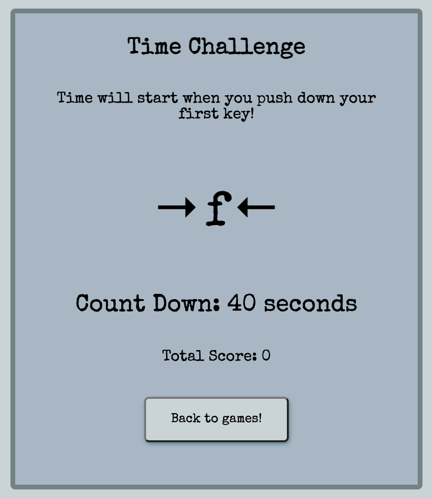
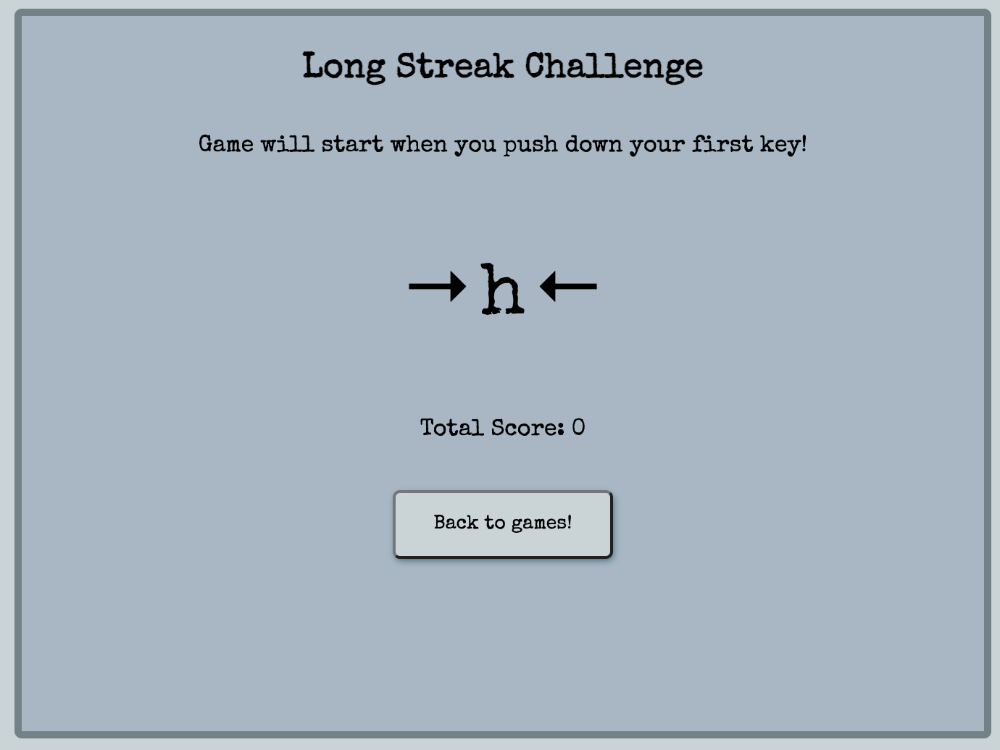
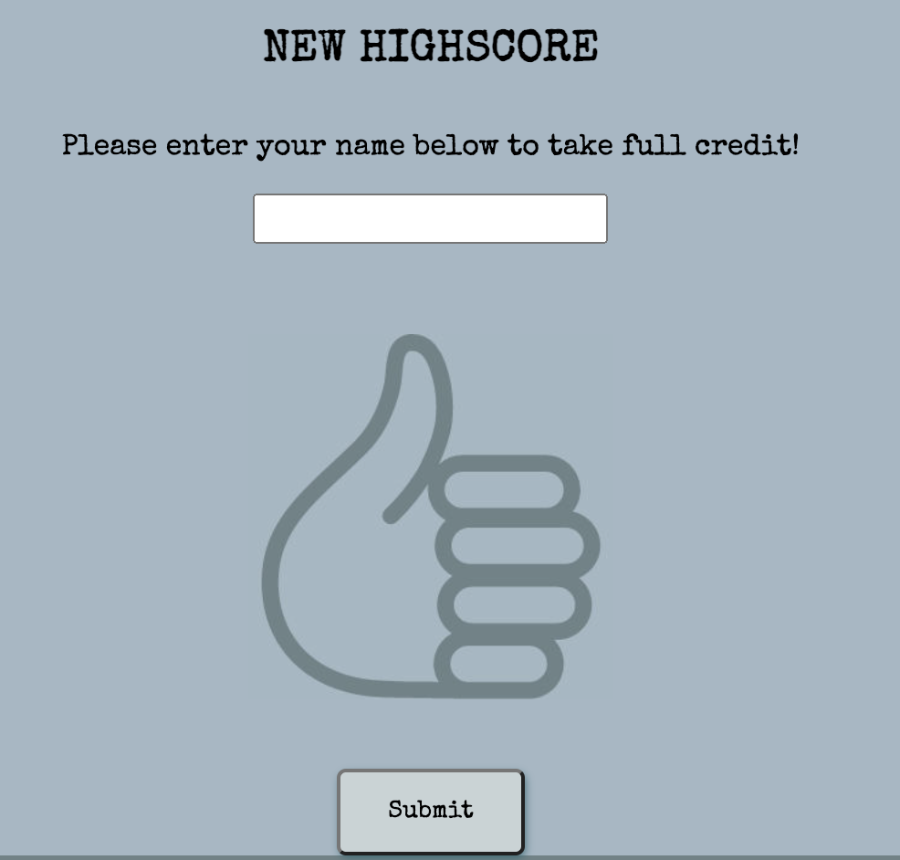
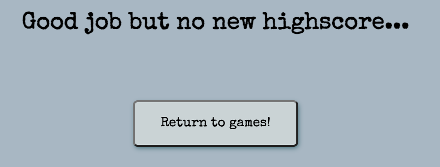

# Test Your Typing

Test Your Typing is a interactive online tool that aims to enable users to practice and improve their touch typing skills. The aim is to deliver this in a fun and self competive manner to encourage practice!

Two games modes are provided to in the form of a time and longest streak challenge.

## Table of Contents
+ [Requirements](#requirements "Requirements")
+ [Design](#design "Design")
  + [Wireframes](#wireframes "Wireframes")
  + [Colour Scheme](#colour-scheme "Colour Scheme")
  + [Typography](#typography "Typography")
  + [Imagery](#imagery "Imagery")
+ [Features](#features "Features")
  + [Existing Features](#existing-features "Existing Features")
+ [Testing](#testing "Testing")
  + [Development Process](#development-process "Development Process")
  + [Usability Testing](#usability-testing "Usability Testing")
  + [User Requirement Testing](#user-requirement-testing "User Requirement Testing")
  + [Functional Testing](#functional-testing "Functional Testing")
  + [Validator Testing](#validator-testing "Validator Testing")
  + [Unfixed Bugs](#unfixed-bugs "Unfixed Bugs")
+ [Technologies Used](#technologies-used "Technologies Used")
  + [Main Languages Used](#main-languages-used "Main Languages Used")
+ [Deployment](#deployment "Deployment")
+ [Credits](#credits "Credits")
  + [Content](#content "Content")
  + [Media](#media "Media")

## Requirements

Please see below a table showing the desired requirements for Test Your Typing, with a matrix for importance of feature and feasibility of implementation.

|   Requirement                                       |   Importance  |   Viability/Feasibility  |
|--------------------------------------------------------|------------------|-----------------------------|
|   Provide Information about touch typing            |   5           |   5                      |
|   Provide game style practice                       |   5           |   5                      |
|   Enable high scores to be recorded with user name  |   5           |   5                      |
|   Provide a choice of game modes                    |   4           |   5                      |
|   Enable high scores to be reset                    |   3           |   3                      |

## Design

### Wireframes:

- Please find link to [Full Screen Wireframe](documentation/full-wireframe.pdf)

### Colour Scheme:

- A neutral colour scheme was chosen to enable it to not distract from the games, with a highlight colour for external links.
- The colour scheme was generated from [Coolers](https://coolors.co/c8d3d5-a4b8c4-6e8387-0cca4a)

### Typography:

- Special Elite was used as the font for the website, this was chosen to provide a type writer feel to compliment the typing theme.
- The font style was sourced from [Google Fonts](https://fonts.google.com/)

### Imagery:

There are two images in the website, I have listed their sources below.

- On the home page there is a image of a keyboard, this was sourced from [Wikipedia](https://en.wikipedia.org/wiki/Touch_typing#/media/File:QWERTY-home-keys-position.svg)
- On the high score submission section there is a image of a thumbs up, this was created using tools from [Shutterstock](https://www.shutterstock.com/)

## Features

### Existing Features

#### Title and Home Navigation:

Present at the top of every page is the title header, this is linked to return the user back to the home page. On the game select, time challenge and long streak challenge pages a home icon has been added to this. This is to further communicate to the user that they are able to use this as a link to the home page at any stage of their user journey.

Title on home page -

Title on all other pages -

#### Landing Page:

The landing page of the website, conveys the clear goal of the website to practice typing in a game mode. This is done with the opening line, 'Let the games begin!'. After which is a brief explanation and the user is presented with the option to continue straight to the games.

Further down there is information on type touching, a supporting image and a link to further external information. The link opens up in a new tab so the users access to the site remains.

#### Game Selection:

To provide different approaches for the user to test and practice their typing skills, two different game modes are available. From the landing page, the users progression is to game selection.

Both game options are layed out in the same structure to ensure continuity and ease for user reading. Each game mode is enclosed in its own container, with clear buttons to select the game.

Each section illustrates it's independent highest score that is saved in local storage. Please see example below -

#### Time Challenge:

The Time Challenge game presents the user with a starting key to press and a 40 seconds timer. At the top, it is instructed to the user that the game commences on the first key press. There is also a return to games button so the user can exit at any stage.

Once in progress the timer will start to count down, and each time a key is pressed a new random key is then generated for the user. With each correct key the score increases by 1 and with each incorrect key it decreases by 1. At the end of the game, the final score is then used to compare to the current highest score.

To communicate to the player whether they have clicked the correct key, ongoing feed back in given directly under the random key generation.

Correct score response -

Incorrect score response - 

#### Long Streak Challenge:

The Long Streak Challenge presents the user with continuous random keys until the user selects an incorrect key. For each correct key the score increases by one and then the game ends when an incorrect key is pushed.

The layout of the game is in the same format as the Time Challenge to keep consistent design throughout. As such, game instruction is at the top and there is a return to games selection button at the bottom.

#### Assessment of Highest Score:

For each game there is independent storage of the ongoing highest score. At the end of the game one of two displays become visible to the user.

- Option 1 - New High Score

If the user achieves a new high score, or the first score recorded, the following becomes visible. It informs the user and provides them the ability to add their name to the score and submit it to be saved. Upon submission the user is then returned to the game selection page.

- Option 2 - No New High Score

If the user doesn't achieve a new high score the following becomes visible. This informs the user and then gives them a button to return back to the game selection.

### Future Features:

A lower level requirement was a function to clear the high scores, this would enable the user to restart if they wish. In future development of the site, this should be added to the game select page where the high scores are displayed.

This could be done in the form of a button that when clicked will clear the local storage.

## Testing

### Development Process

Throughout the development process, each feature was tested on a local server to check that the code added was working as intended. This then resulted in realtime changes before commiting the new features. Below is a list of bugs that were discussed through development.

#### Random Letter Generator

- The initial array for the random letter generator included 'tab' and 'delete' keys. In the testing process, it was discovered that if you pushed the tab key the title element of the page was selected. If this was then followed by 'enter' it would exit the user from the game and return them to the home page.  
Additionally, it came to light that for MAC users, a delete key is not present and therefore restricted accessibility to windows users.  
As a result, both of these key options were removed from the array.

- When using the games, the random letter generator on occassion would present 'undefined'. Upon investigation it was found that this was due to the random number function that was used to randomly select from the keys array. It was not taken into account that array indexing starts with a '0' and therefore the random number selector had to be one less than the total strings present.  
Upon adjusting the number generator, 'undefined' no longer was generated in game play.

#### Time Challenge - Count Down

- After first implementing the count down timer in full game testing, it was discovered that every time a key was clicked the timer function was called. This resulted in the timer decreasing and increasingly fast rates.  
This was due to the event listener that was added to key push down. To resolve this issue, `{once : true}` was added to ensure that it could only be activated once.

#### Reading Exisiting High Score

- Within the `topScore()` function, the local storaged is retrived to compare the data to the score of the game. Initially, when this was implemented it caused an error as the if statement was unable to read the value of the key pair. Upon further investigation, it was discovered that due to the format of the data pulled via JSON it was not compatibly to check against a number. 
Upon further research, a second step was added to format the data into a string which enabled the function to select the number value and change its data type.
`Object.keys(stringScoreReturn).map((key) => [Number(key), stringScoreReturn[key]])`
`if(parseInt(score.innerHTML) > parseInt(number)){`

#### Storing Seperate High Scores

- After the Time Challenge script was completed, the code was copied over to a new script to run the Long Streak Challenge. This was done as there were multiple functions that are required for both games. After making the required alternations for the new game mode, game run through was tested. 
It was discoved that when one game achieve a new high score, it would overwrite the others. This became apparent when checking the high scores displayed on the game select screen and that both were showing the same data.  
Upon further investigation and research into local storage, this was because the `topScore()` function was using the same key when sending the data to the local storage. To resolve this issue, the function was altered in the Long Streak Challenge script to assign a different key to the data. 
This then resolved the issue and they both had independent storage of their respective highest scores. The solution was tested with the high score display on the game select page.

### Usability Testing

- All pages are responsive to multiple screen sizes, main screen sizes designed for ipad sizes and above due to nature of game for touch typing.
- Title link to home page works on all pages.
- All buttons links to appropriate destinations.
- External links open in new browser tabs.
- Images hold alternatives to for accessibility.
- Color scheme appropriate for accessibility.
- Website checked on multiple browsers including chrome, firefox and safari.
- Lighthouse run on each page to check for performace, accessibility, best practice and SEO. All tests returned positive results which are shown below in the link to full reports.

  -   
  -   
  -   
  -   

### User Requirement Testing

|   User Case  |   Description                                                                                                |   Relevant test cases                                                    |   Result  |   Comments                                                                |
|-----------------|-----------------------------------------------------------------------------------------------------------------|--------------------------------------------------------------------------------------|--------------|------------------------------------------------------------------------------|
|   UC-001     |   As a user I want to be able to learn about touch typing and gain further information.                      |   TC-002                                                                          |   Pass    |                                                                           |
|   UC-002     |   As a user I want to practice to improve the speed of my touch typing.                                      |   TC-004, TC-011                                                                  |   Pass    |                                                                           |
|   UC-003     |   As a user I want to test the accuracy of my typing to see how long I can type for before making an error.  |   TC-005, TC-019                                                                  |   Pass    |                                                                           |
|   UC-004     |   As a user I want to be able to be able to see a record of my highest scores.                               |   TC-006, TC-007, TC-008, TC-009, TC-013, TC-014, TC-015, TC-021, TC-022, TC-023  |   Pass    |                                                                           |
|   UC-005     |   As a user I wish to be able to reset my high scores                                                        |                                                                                   |   Fail    |   A lower level requirement that will be implemented as a future feature  |
|   UC-006     |   As a user I wish to be able to return to the home screen at any stage.                                     |   TC-003, TC-010, TC-018                                                          |   Pass    |                                                                           |
|   UC-007     |   As a user I wish to be able to return to the game selection at any stage.                                  |   TC-001, TC-012, TC-020                                                          |   Pass    |                                                                           |

### Functional Testing

Functional Test Cases

|   Test Case  |   Description                                                                                                |   Pre Conditions                                                                              |   Steps to Executed                                                                                                                                                                      |   Result  |   Comments  |
|-----------------|-----------------------------------------------------------------------------------------------------------------|--------------------------------------------------------------------------------------------------|---------------------------------------------------------------------------------------------------------------------------------------------------------------------------------------------|--------------|----------------|
|   TC-001     |   Home Page - Continue button opens page to select game mode.                                                |   N/A                                                                                         |   1. Active page is index.html  2. Click ‘Continue’ button  3. Check that active page is now game select.html                                                                      |   Pass    |             |
|   TC-002     |   Home Page - Link to Wikipedia Touch Typing opens in a new tab.                                             |   N/A                                                                                         |   1. Active page is index.html  2. Click on Wikipedia link  3. Check Wikipedia opens on new tab in browser                                                                         |   Pass    |             |
|   TC-003     |   Game Select Page - Home icon and title returns user to home page.                                          |   N/A                                                                                         |   1. Active page is gameselect.html  2. Click on home icon link  3. Check active page changes to index.html                                                                        |   Pass    |             |
|   TC-004     |   Game Select Page - In the Time Challenge section, ’Let’s Go!’ Button opens the Time Challenge game.        |   N/A                                                                                         |   1. Active page is gameselect.html  2. Click on ‘Let’s Go!’ Button under Time Challenge  3. Check active page changes to timechallenge.html                                       |   Pass    |             |
|   TC-005     |   Game Select Page - In the Long Steak section, ’Let’s Go!’ Button opens the Long Streak game.               |   N/A                                                                                         |   1. Active page is gameselect.html  2. Click on ‘Let’s Go!’ Button under Long Streak Challenge  3. Check active page changes to longstreak.html                                   |   Pass    |             |
|   TC-006     |   Game Select Page - Time Challenge high score displays ‘-‘ when no score is stored.                         |   No high score for Time Challenge is stored in Local Storage                                 |   1. Active page is gameselect.html  2. Check high score table in the Time Challenge section displays ‘-‘ values under name and score                                                 |   Pass    |             |
|   TC-007     |   Game Select Page - Long Streak Challenge high score displays ‘-‘ when no score is stored.                  |   No high score for Long Streak Challenge is stored in Local Storage                          |   1. Active page is gameselect.html  2. Check high score table in the Long Streak Challenge section displays ‘-‘ values under name and score                                          |   Pass    |             |
|   TC-008     |   Game Select Page - Time Challenge high score displays user name and score held in Local Storage.           |   High score has been recorded in Local Storage from the Time Challenge                       |   1. Active page is gameselect.html  2. Check high score table in the Time Challenge section displays the user name and score held in Local Storage                                   |   Pass    |             |
|   TC-009     |   Game Select Page - Long Streak Challenge high score displays user name and score held in Local Storage.    |   High score has been recorded in Local Storage from the Long Streak Challenge                |   1. Active page is gameselect.html  2. Check high score table in the Long Streak Challenge section displays the user name and score held in Local Storage                            |   Pass    |             |
|   TC-010     |   Time Challenge Page - Home icon and title returns user to home page.                                       |   N/A                                                                                         |   1. Active page is timechallenge.html  2. Click on home icon link  3. Check active page changes to index.html                                                                     |   Pass    |             |
|   TC-011     |   Time Challenge Page - Game starts on user first key push down event.                                       |   N/A                                                                                         |   1. Active page is timechallenge.html  2. Push down any key on the keyboard  3. Check timer starts to count down and score increases/decreases appropriately                      |   Pass    |             |
|   TC-012     |   Time Challenge Page - ‘Back to Games!’ Button returns the user to the Game Select page.                    |   N/A                                                                                         |   1. Active page is timechallenge.html  2. Click on ‘Back to Games!’ Button  3. Check active page is now gameselect.html                                                           |   Pass    |             |
|   TC-013     |   Time Challenge Page - Upon game ending, if high score is achieved, new high score submission is shown.     |   At the end of the game, the score is higher than the one currently stored in Local Storage  |   1. Active page is timechallenge.html  2. Complete game with final score being higher than currently stored  3. Check new high score submission appears                           |   Pass    |             |
|   TC-014     |   Time Challenge Page - High Score submission allows the user to type in the name for score storage.         |   The high score submission is open for Time Challenge                                        |   1. Click into input text field.  2. Type name in field                                                                                                                              |   Pass    |             |
|   TC-015     |   Time Challenge Page - High Score submission allows the user to submit the new score                        |   The high score submission is open for Time Challenge and user name has been entered         |   1. Click on the submission button.  2. Check that the new high score has overwritten the previous in Local Storage.                                                                 |   Pass    |             |
|   TC-016     |   Time Challenge Page - Upon game ending, if no high score is achieved, a pop up appears to inform the user  |   At the end of the game, the score is lower than the one held in Local Storage               |   1. Active page is timechallenge.html  2. Complete game with final score being lower than currently stored  3. Check pop up appears to inform the user no new high score achieve  |   Pass    |             |
|   TC-017     |   Time Challenge Page - No high score pop up allows the user to return to game select page.                  |   The no high score pop up for Time Challenge is open                                         |   1. Click on ‘Return to Games!’ Button  2.Check that active page is now gameselect.html                                                                                              |   Pass    |             |
|   TC-018     |   Long Streak Page - Home icon and title returns user to home page.                                          |   N/A                                                                                         |   1. Active page is longstreak.html  2. Click on home icon link  3. Check active page changes to index.html                                                                        |   Pass    |             |
|   TC-019     |   Long Streak Page - Game starts on user first key push down event.                                          |   N/A                                                                                         |   1. Active page is longstreak.html  2. Push down requested key on the keyboard  3. Check new letter appears and score goes up                                                     |   Pass    |             |
|   TC-020     |   Long Streak Page - ‘Back to Games!’ Button returns the user to the Game Select page.                       |   N/A                                                                                         |   1. Active page is longstreak.html  2. Click on ‘Back to Games!’ Button  3. Check active page is now gameselect.html                                                              |   Pass    |             |
|   TC-021     |   Long Streak Page - Upon game ending, if high score is achieved, new high score submission is shown.        |   At the end of the game, the score is higher than the one currently stored in Local Storage  |   1. Active page is longstreak.html  2. Complete game with final score being higher than currently stored  3. Check new high score submission appears                              |   Pass    |             |
|   TC-022     |   Long Streak Page - High Score submission allows the user to type in the name for score storage.            |   The high score submission is open for Long Streak Challenge                                 |   1. Click into input text field.  2. Type name in field                                                                                                                              |   Pass    |             |
|   TC-023     |   Long Streak Page - High Score submission allows the user to submit the new score                           |   The high score submission is open for Long Streak Challenge and user name has been entered  |   1. Click on the submission button.  2. Check that the new high score has overwritten the previous in Local Storage.                                                                 |   Pass    |             |
|   TC-024     |   Long Streak Page - Upon game ending, if no high score is achieved, a pop up appears to inform the user     |   At the end of the game, the score is lower than the one held in Local Storage               |   1. Active page is longstreak.html  2. Complete game with final score being lower than currently stored  3. Check pop up appears to inform the user no new high score achieve     |   Pass    |             |
|   TC-025     |   Long Streak Page - No high score pop up allows the user to return to game select page.                     |   The no high score pop up for Long Streak Challenge is open                                  |   1. Click on ‘Return to Games!’ Button  2.Check that active page is now gameselect.html                                                                                              |   Pass    |             |

### Validator Testing

### Unfixed Bugs
- No known bugs

## Technologies Used
### Main Languages Used
- HTML5
- CSS3
- JavaScript

## Deployment
This site is deployed through GitHub Pages. The following steps where followed -
- Within the repository, go to settings
- Under settings select pages section
- Select source 'Deploy from a branch'
- Underneath source, select main branch and root folder and save to deploy

## Credits

### Content

### Media
